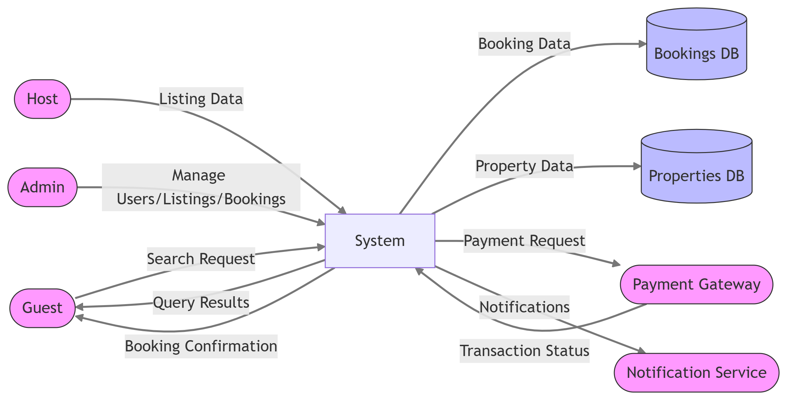

# Data Flow Diagram (DFD) - Level 0

This directory contains the Level 0 Data Flow Diagram for the Airbnb Clone backend project.

## Diagram Overview

The diagram illustrates the main data flows between the key actors and the system, as well as interactions with external services and databases.

### Key Entities

- **Guest:** Searches for properties and makes bookings.
- **Host:** Adds and manages property listings.
- **Admin:** Manages users, listings, and bookings in the system.

### Data Stores

- **Properties DB:** Stores information about property listings.
- **Bookings DB:** Stores booking details.

### External Services

- **Payment Gateway:** Handles payment processing.
- **Notification Service:** Sends notifications to users regarding bookings, payments, and updates.

## Purpose

This diagram helps visualize how data moves through the system during core backend operations, providing a high-level understanding of system processes and integrations.

## File

- `data-flow-diagram.png`: Visual representation of the data flow within the Airbnb Clone backend system.

