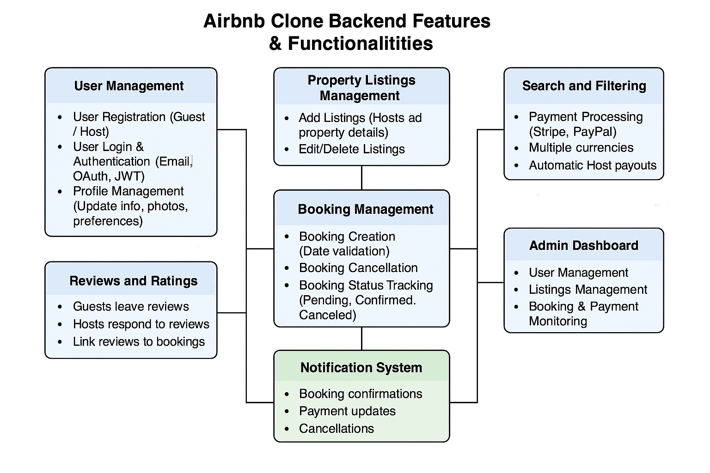

# Features and Functionalities - Airbnb Clone Backend

This document outlines the core backend features and functionalities required for the Airbnb Clone project. The backend aims to support a robust rental marketplace system that allows users to register, list properties, book stays, manage payments, and more.

## Core Features

- **User Management**  
  Allows users to register as guests or hosts, login securely using email/password or OAuth, and manage their profiles (update information and photos).

- **Property Listings Management**  
  Hosts can create, update, and delete property listings including details like title, description, location, price, amenities, and availability.

- **Search and Filtering**  
  Enables users to search for properties based on criteria such as location, price range, number of guests, and amenities, with pagination support for large result sets.

- **Booking Management**  
  Guests can create bookings with date validation to prevent overlaps, cancel bookings following policy rules, and track booking status (pending, confirmed, canceled, completed).

- **Payment Integration**  
  Supports secure payment processing using gateways like Stripe and PayPal, handles multiple currencies, collects upfront payments, and processes automatic payouts to hosts.

- **Reviews and Ratings**  
  Allows guests to leave reviews and ratings linked to specific bookings, while hosts can respond to feedback, helping maintain trust and quality.

- **Notification System**  
  Sends email and in-app notifications for booking confirmations, cancellations, and payment updates to keep users informed.

- **Admin Dashboard**  
  Provides administrative tools to monitor and manage users, listings, bookings, and payments for effective system oversight.

## Diagram

Below is a visual representation of the backend features and how they interact:

