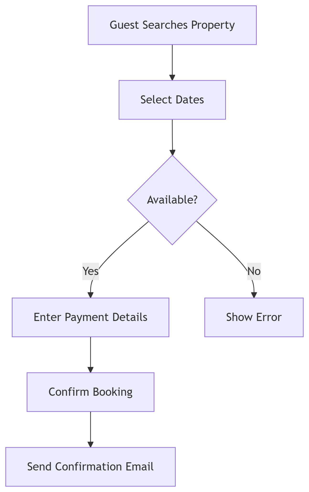

# Booking Flowchart

This flowchart illustrates the key steps and decision points in the **property booking** process for the Airbnb Clone backend.

## Flowchart Description

1. **Guest Searches Property**: The user initiates a property search.
2. **Select Dates**: The guest selects the desired booking dates.
3. **Availability Check**: The system checks if the property is available for those dates.

   * If **available**, the flow continues.
   * If **not available**, an error message is displayed.
4. **Enter Payment Details**: The guest inputs payment information.
5. **Confirm Booking**: The system processes the booking.
6. **Send Confirmation Email**: A confirmation email is sent to the guest.

## File

* `booking-flowchart.png`: Visual representation of the booking process workflow.

This flowchart helps visualize the booking workflow and key system interactions to ensure smooth user experience and backend processing.

