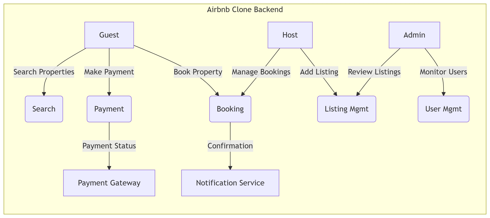

# Use Case Diagram

This directory contains the Use Case Diagram for the Airbnb Clone backend project.

## Diagram Overview

The Use Case Diagram visualizes the main interactions between different types of users (actors) and the system. It highlights the functionalities that each actor can perform.

### Actors

- **Guest**: A user who browses and books properties.
- **Host**: A user who lists and manages their properties.
- **Admin**: A user who manages the overall system, including users, listings, and bookings.

### Use Cases

- Register
- Login
- Update Profile
- Add Listing
- Edit/Delete Listing
- Search Listings
- Book Property
- Cancel Booking
- Make Payment
- Leave Review
- Respond to Reviews
- Receive Notifications
- Manage Users (Admin)
- Manage Listings (Admin)
- Manage Bookings (Admin)
- Manage Payments (Admin)
- Send Notifications (Admin)

## File

- `use-case-diagram.png`: The visual representation of system use cases.

## Purpose

This diagram helps to understand the high-level functional requirements and system interactions clearly and quickly.

